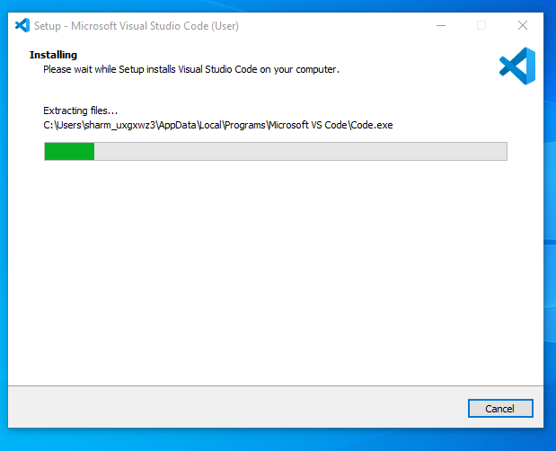

[](https://classroom.github.com/a/XoLGRbHq)
[](https://classroom.github.com/online_ide?assignment_repo_id=15294569&assignment_repo_type=AssignmentRepo)
# SE-Assignment-5
Installation and Navigation of Visual Studio Code (VS Code)
 Instructions:
Answer the following questions based on your understanding of the installation and navigation of Visual Studio Code (VS Code). Provide detailed explanations and examples where appropriate.

 Questions:

1. Installation of VS Code:
   - Describe the steps to download and install Visual Studio Code on Windows 11 operating system. Include any prerequisites that might be needed.

   Installation of VS Code on Windows 11

 Prerequisites:
 Before installing Visual Studio Code (VS Code), ensure your Windows 11 system meets the minimum requirements specified by Microsoft. The requirements are:
 To download and install Visual Studio Code (VS Code) on a Windows 11 operating system, follow these steps:

Prerequisites:
Operating System: Windows 11 (64-bit recommended).
2. Internet Connection: Required to download the installer and for some features such as extensions.
3. User Permissions: Administrator privileges may be required to install software.

Steps to Download and Install VS Code:

1. Visit the Official Website:
- Open your web browser and go to the official Visual Studio Code website: [https://code.visualstudio.com/] 


2. Download the Installer:
- Click on the "Download for Windows" button. This will download the VS Code installer for Windows.

3. Run the Installer:
- Once the download is complete, open the downloaded file to run the installer.


4. Accept the License Agreement:
- Read and accept the license agreement to proceed with the installation.


5. Select Installation Location:
- Choose the destination folder where you want to install VS Code, or use the default location.


6.Choose Additional Tasks:
- Select any additional tasks you want to perform, such as creating a desktop icon or adding VS Code to the system PATH. These options can make it easier to launch and use VS Code.


7. Install:
- Click on the "Install" button to begin the installation process.



8. Launch VS Code:
- Once the installation is complete, you can choose to launch VS Code immediately by checking the "Launch Visual Studio Code" option before clicking "Finish".


Source: 

2. First-time Setup:
   - After installing VS Code, what initial configurations and settings should be adjusted for an optimal coding environment? Mention any important settings or extensions.

 Initial Setup Wizard
 - When you first launch VS Code, it may display a welcome page and a setup wizard to help you configure initial settings.

 Initial Configurations and Settings:

i. Theme:
- Go to File > Preferences > Colour Theme to choose a theme that suits your preference.

ii. Font Size:
   - Adjust the font size by navigating to File > Preferences > Settings, then searching for "Font Size".

 

Set Preferences: Customise VS Code behaviour via File > Preferences > Settings.
Configure Keybindings: Adjust keybindings via File > Preferences > Keyboard Shortcuts.


2. Install Recommended Extensions:
- VS Code may suggest installing popular extensions based on your detected programming languages and frameworks.

Explore and install extensions that enhance your workflow (Extensions view on the Activity Bar).
Extensions:
- Install essential extensions such as:
     - Prettier for code formatting.
     - Python for Python development.
     - Live Server for live-reloading web development.


3. Sign In:
   - You can sign in with your Microsoft or GitHub account to sync your settings across devices.


3. User Interface Overview:
   - Explain the main components of the VS Code user interface. Identify and describe the purpose of the Activity Bar, Side Bar, Editor Group, and Status Bar.

User Interface Overview:
a. Activity Bar:
Provides quick access to different views like Explorer, Search, Source Control, Run, and Extensions.

b. Side Bar: Contains views like Explorer (file browser), Search, Git (source control), and Extensions.

c. Editor Group: Where your files open for editing.

d. Status Bar: Located at the bottom, it shows information about the current workspace, such as the selected programming language, Git branch, and error/warning counts.


4. Command Palette:
   - What is the Command Palette in VS Code, and how can it be accessed? Provide examples of common tasks that can be performed using the Command Palette.

The Command Palette in Visual Studio Code is a powerful tool that provides quick access to a wide range of commands and functions within the editor. It allows you to perform actions and access settings without having to navigate through menus or remember complex keyboard shortcuts.

Accessing the Command Palette:
- Press `Ctrl+Shift+P` or `F1` to open the Command Palette.

-Common Tasks:

- Change the colour theme: `Preferences: Colour Theme`.
  Type >Preferences: Color Theme to switch between different color themes.
  
- Install extensions: `Extensions: Install Extensions`.
  Type >Extensions: Install Extensions to open the Extensions view and search for new extensions to install.

- Open a new terminal: `Terminal: Create New Integrated Terminal`.
  Git Commands:
   Type >Git: Clone to clone a repository.
   Type >Git: Commit to commit changes with a message.


5. Extensions in VS Code:
   - Discuss the role of extensions in VS Code. How can users find, install, and manage extensions? Provide examples of essential extensions for web development.

   Extensions enhance the functionality of VS Code, providing support for additional languages, debuggers, and tools.

- Finding and Installing Extensions:
  - Click on the Extensions view icon in the Activity Bar or press `Ctrl+Shift+X` to open the Extensions view.
  - Search for extensions by name or keyword, then click "Install" to add them to VS Code.
- Managing Extensions:
  - Manage installed extensions from the Extensions view, where you can enable, disable, update, or uninstall them.

Here are some of the essential VS Code extensions for web development:

Code Quality and Formatting
- Prettier - Code Formatter: Enforces consistent code style.

Productivity and Workflow
- Live Server: Local server with live reload.

Framework and Library Support
- Debugger for Chrome**: Debug JavaScript in Chrome.

Version Control and Collaboration
- GitLens: Enhances Git capabilities.
- GitHub Pull Requests and Issues: Manage GitHub PRs and issues.

CSS and Styling
- CSS Peek: Peek at CSS definitions in HTML.


6. Integrated Terminal:
   - Describe how to open and use the integrated terminal in VS Code. What are the advantages of using the integrated terminal compared to an external terminal?

 Opening the Integrated Terminal in VS Code

1. Keyboard Shortcut: Press `Ctrl + ` (backtick).
2. Menu: Go to `View > Terminal`.
3. Command Palette: Press `Ctrl + Shift + P`, type `Terminal: Create New Integrated Terminal`, and press `Enter`.

Using the Integrated Terminal

- Switch Terminals: Use the dropdown in the terminal panel.
- Create New Terminal: Click the `+` icon or press `Ctrl + Shift + ` (backtick).
- Split Terminals: Click the split terminal icon.
- Run Commands: Execute commands like `git`, `npm`, or `python`.

Advantages of the Integrated Terminal

1.Convenience: Work within a single application.
2.Workspace Awareness: Opens in the root directory of your workspace.
3.Consistency: Uses the same shell and environment variables as your workspace.
4.Extension Integration: Works seamlessly with VS Code extensions.
5.Multitasking: Open multiple terminals in tabs or split panes.
6.Customization: Configure shell, appearance, and behavior to match your preferences.

7. File and Folder Management:
   - Explain how to create, open, and manage files and folders in VS Code. How can users navigate between different files and directories efficiently?

Creating Files and Folders

1. Explorer View:
   - New File: Click the `New File` icon or right-click in a folder and select `New File`.
   - New Folder: Click the `New Folder` icon or right-click and select `New Folder`.

2. Command Palette:
   - New File: Press `Ctrl + Shift + P`, type `File: New File`, and press `Enter`.

Opening Files and Folders

1. Explorer View: Click on files or folders to open them.
2. Command Palette: Press `Ctrl + P`, type the file name, and press `Enter`.
3. Menu: Go to `File > Open File` or `File > Open Folder`.

Managing Files and Folders

1. Rename: Right-click and select `Rename` or press `F2`.
2.Move: Drag and drop files/folders in the Explorer view.
3. Delete: Right-click and select `Delete` or press the `Delete` key.

Efficient Navigation

1. Quick Open: Press `Ctrl + P` to quickly open files.
2. Breadcrumbs: Enable from `View > Show Breadcrumbs` for quick navigation.
3. Explorer View: Click through directories and files.
4. Go to Definition/Peek: Right-click and select for quick code navigation.
5. File Tabs: Click tabs at the top of the editor to switch files.
6. Toggle Explorer: Press `Ctrl + B` to show/hide the Explorer view.
7. Search: Press `Ctrl + Shift + F` to search across files.


8. Settings and Preferences:
   - Where can users find and customize settings in VS Code? Provide examples of how to change the theme, font size, and keybindings.

   Use the Settings editor to review and change VS Code settings. To open the Settings editor, navigate to File > Preferences > Settings. Alternately, open the Settings editor from the Command Palette (Ctrl+Shift+P) with Preferences: Open Settings or use the keyboard shortcut (Ctrl+,).

 Customizing Settings in VS Code

  Accessing Settings

- Menu: `File > Preferences > Settings` 
- Command Palette: `Ctrl + Shift + P` , type `Preferences: Open Settings`.
- Keyboard Shortcut: `Ctrl + ,` 

 Examples

1. Changing the Theme
   - Settings UI: `File > Preferences > Color Theme`, then select a theme.
   - Command Palette: `Ctrl + Shift + P`, type `Preferences: Color Theme`, select a theme.

2. Changing the Font Size
   - Settings UI: Open Settings, search `font size`, adjust `Editor: Font Size`.

3. Changing Keybindings
   - Settings UI: `File > Preferences > Keyboard Shortcuts`, find command, click pencil icon, press new key combination.
   - Keybindings JSON: Open `keybindings.json`, add/update:
     ```json
     {
       "key": "ctrl+k ctrl+c",
       "command": "editor.action.commentLine",
       "when": "editorTextFocus"
     }
     ```

9. Debugging in VS Code:
   - Outline the steps to set up and start debugging a simple program in VS Code. What are some key debugging features available in VS Code?

   Steps to Set Up and Start Debugging

1. Open Your Project
   - `File > Open Folder`

2. Open the File to Debug
   - Open your code file.

3. Set Breakpoints
   - Click in the left margin next to the line number or press `F9`.

4. Create a Debug Configuration
   - Explorer View: Click `Run and Debug` or press `Ctrl + Shift + D`   
   - Create Configuration: Click `create a launch.json file`, choose your environment, and VS Code will generate a `launch.json`.
  

5. Start Debugging
   - Run: Click the green play button or press `F5`.
   - Run Without Debugging: Press `Ctrl + F5.

6. Debugging Session Controls
   - Continue (F5): Resume execution.
   - Over (F10): Move to the next line.
   - Step Into (F11): Enter the function.
   - Step Out (Shift + F11): Exit the function.
   - Stop Debugging (Shift + F5): End the session.

Key Debugging Features

- Breakpoints: Pause code execution.
- Debug Console: View outputs and run commands.
- Watch Variables: Monitor variable values.
- Call Stack: Inspect function calls.
- Panel: View and change variable values.
- Inline Breakpoints and Logpoints: Advanced debugging features.

10. Using Source Control:
    - How can users integrate Git with VS Code for version control? Describe the process of initializing a repository, making commits, and pushing changes to GitHub.

 1. Install Git

 - Download from [Git Downloads](https://git-scm.com/downloads) and install it.

 2. Initialize a Git Repository

- Open VS Code and open your project folder.
- Source Control View: Click the `Source Control` icon or press `Ctrl + Shift + G` 
- Initialize: Click `Initialize Repository` or run `git init` in the terminal.

 3. Configure Git

- Set Name and Email

  ```bash
  git config --global user.name "Your Name"
  git config --global user.email "your.email@example.com"
  ```

 4. Stage and Commit Changes*

- Stage: Click the `+` icon or run `git add .` in the terminal.
- Commit: Enter a message and click the checkmark or run `git commit -m "Your commit message"`.

 5. Push Changes to GitHub

- Create a GitHub Repo: Go to [GitHub](https://github.com/) and create a new repository.
- Add Remote:

  ```bash
  git remote add origin https://github.com/yourusername/your-repo-name.git
  ```
- Push:

  ```bash
  git push -u origin master
  ```
  or if using `main`:

  ```bash
  git push -u origin main
  ```

 6. Pull Changes from GitHub

- Pull Click the `...` icon and select `Pull` or run `git pull origin main` in the terminal.

 Key Features

- Breakpoints: Pause code execution.
- Debug Console: View outputs and run commands.
- Watch Variables: Monitor variable values.
- Call Stack: Inspect function calls.
- Variables Panel: View and change variable values.
- Inline Breakpoints and Logpoints: Advanced debugging features.


 Sources:
    1. https://code.visualstudio.com/docs/setup/windows

    2. https://code.visualstudio.com/docs/terminal/basics

    3. https://www.studocu.com/en-za/messages/question/7903534/explain-how-to-create-open-and-manage-files-and-folders-in-vs-code-how-can-users-navigate
    
    4. https://code.visualstudio.com/docs/getstarted/userinterface
    https://docs.servicenow.com/bundle/tokyo-application-development/page/build/applications/task/vscode-create-file.html

    5. https://code.visualstudio.com/docs/getstarted/settings#:~:text=Use%20the%20Settings%20editor%20to,keyboard%20shortcut%20(Ctrl%2B%2C).

    6. https://code.visualstudio.com/docs/editor/debugging#:~:text=To%20run%20or%20debug%20a,and%20save%20debugging%20setup%20details.

    7.https://code.visualstudio.com/docs/sourcecontrol/intro-to-git#:~:text=Pick%20an%20existing%20or%20new,init%20on%20the%20command%2Dline.
     

 Submission Guidelines:
- Your answers should be well-structured, concise, and to the point.
- Provide screenshots or step-by-step instructions where applicable.
- Cite any references or sources you use in your answers.
- Submit your completed assignment by 1st July 

